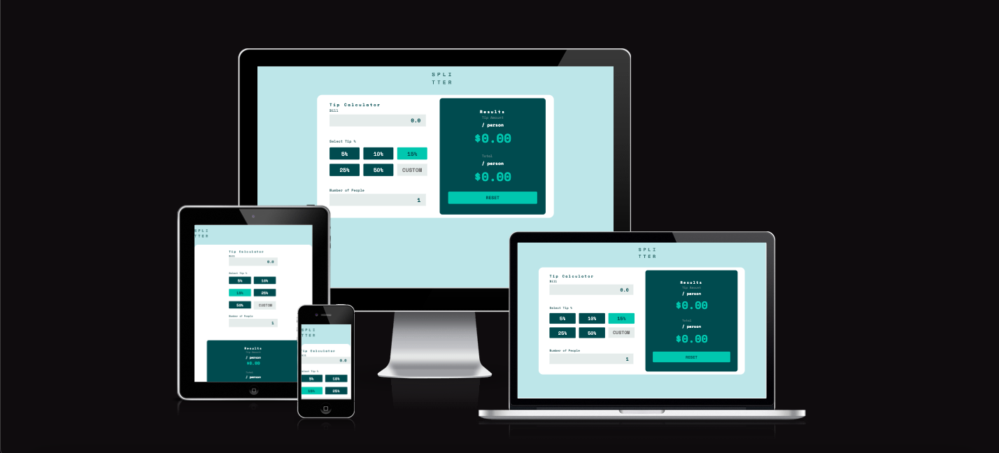

____
**Table of Contents**

- [__SPLITTER-Milestone 2nd project__](#splitter-milestone-2nd-project)
  - [__Description__](#description)
  - [_SPLITTER responsive website_\_](#splitter-responsive-website_)
  - [__Design__](#design)
  - [__color scheme__](#color-scheme)
  - [Primary color](#primary-color)
    - [Neutral](#neutral)
    - [__Typography__](#typography)
  - [__Structure__](#structure)
  - [__Features__](#features)
    - [Current Feature](#current-feature)
    - [Future Implementations](#future-implementations)
    - [__Technologies Used__](#technologies-used)
    - [HTML](#html)
    - [CSS](#css)
  - [Google Fonts](#google-fonts)
    - [Google Fonts](#google-fonts-1)
    - [Visual Studio Code](#visual-studio-code)
    - [Techsini](#techsini)
    - [Github](#github)
    - [Github Pages](#github-pages)
  - [**__Testing__**](#testing)
  - [**Deployment**](#deployment)
    - [**Starting The Project**](#starting-the-project)
  - [**Deployment to cloud platform**](#deployment-to-cloud-platform)
  - [**Credits**](#credits)
    - [**Acknowledgements**](#acknowledgements)

# __SPLITTER-Milestone 2nd project__

## __Description__
This App is created for the second project of Code Institute's [Diploma in Full Stack Software Development](https://codeinstitute.net/ie/full-stack-software-development-diploma/). The  main criteria of used technologies was JavaScript essential and very basic.
mainly the target was to explore and practice JavaScript ES6 List methods, filter(), forEach(), map(),reduce().

You can have a Live view of website [here](https://shahbakhat.github.io/Milestone-project-2).

---
## _SPLITTER responsive website__

As the important criteria of the project the site is fully responsive to different displays. as it is only one page app just a calculator the responsiveness was easy to handle.
___
## __Design__
## __color scheme__
Design was taken from  [frontendmentor.com](https://www.frontendmentor.io/home) as a challenge for beginners.
## Primary color
- Strong cyan: hsl(172, 67%, 45%)

### Neutral

- Very dark cyan: hsl(183, 100%, 15%)
- Dark grayish cyan: hsl(186, 14%, 43%)
- Grayish cyan: hsl(184, 14%, 56%)
- Light grayish cyan: hsl(185, 41%, 84%)
- Very light grayish cyan: hsl(189, 41%, 97%)
### __Typography__

all through the website the  __Space Mono__ font is used from Google fonts library.
___
## __Structure__
The App is structured to let the user calculate the tip of different percentages as in the App specified or custom percentage of tips and divided by the number of people.
____
## __Features__

### Current Feature
The has currently just simple calculation methods to calculate Tips over any bill value.
### Future Implementations
In future the App can be improved as in a calculator used for different methods such as temperature conversion and some other functionalities such as scientific calculator or a mortgage calculator
___
### __Technologies Used__
____
### HTML
The Layouts of the websites are created and designed using HTML Markup computer language.
### CSS
The website was styled by using custom CSS.
## Google Fonts
custom JavaScript was used for basic DOM manipulation, and very basic JavaScript essentials were practiced.
### Google Fonts
*Space Mono* Fonts were used from Google Fonts library.

### Visual Studio Code

VS code was used as an IDE(*Integrated Development Environment*) to develop this website .

### Techsini
Techsini.com was used to create a mockup for multiple devices and mockup was generated for this README file.

### Github
Github was used to store all the source code for this website

### Github Pages
Using github pages this website was deployed online.
____
## **__Testing__**
___

To make sure everything is all in place and working testing was done on the whole website.
responsiveness was tested on all  devices using 
*Google Chrom Dev Tools* and *[responsivedesignchecker.com](https://responsivedesignchecker.com/checker.php?url=https%3A%2F%2Fshahbakhat.github.io%2FMilestone-project-2%2F&width=1400&height=700)* . All buttons were tested if they are properly linked to the relative link and accessibility test was done for visual effects. all the color contrasts were tested using [webaim.org](https://webaim.org/resources/contrastchecker/).
HTML was tested using W3C [HTML validator](https://validator.w3.org/).
To test CSS code the [Jigsaw](https://jigsaw.w3.org/css-validator/) was used.
To test javaScript code [jSHINT](https://jshint.com/) was used.

| Tests  |      Expectations      | Pass/Fail |
|----------|:-------------:|------:|
|__Testing Responsiveness on Google Chrome__ |  Elements are not going out of the flow by decreasing the sizes for different screens and imagery is in right size and width ***____Steps:*** To open the developer console in Google Chrome, open the Chrome Menu in the upper-right-hand corner of the browser window and select More Tools > Developer Tools.You can also use Option + ⌘ + J (on macOS), or Shift + CTRL + J (on Windows/Linux)| **PASS** |
| __Testing Responsiveness on Mozilla Firefox__ |   Elements are not going out of the flow by decreasing the sizes for different screens and imagery is in right size and width.***_____Steps:*** To open the developer console in Firefox, click on the Firefox Menu in the upper-right-hand corner of the browser and select More Tools > Browser Console.You can also use the shortcut Shift + ⌘ + J (on macOS) or Shift + CTRL + J (on Windows/Linux).|   **PASS** |
| __Testing Responsiveness on Microsoft Edge__ | Elements are not going out of the flow by decreasing the sizes for different screens and imagery is in right size and  width.***_____Steps:*** To open the developer console in Microsoft Edge, open the Edge Menu in the upper-right-hand corner of the browser window and select More Tools > Developer Tools.You can also press CTRL + Shift + i to open it.|   **PASS** |
|  __Testing Buttons if they all are working according to their functionality__| All buttons 5%,10%,15%,25%,50% are outputting correct values, the RESET button resets all the values to zero.  |   **PASS** |
| __Testing Hover effects on all the buttons__ | By hovering the cursor each Element responds to the coded design.  |    **PASS** |
| __Testing All inputs are working__| All inputs are working as they supposed to, all the input have correct output value as programmed, when number of people are less then 1 there is an error **cant be less than zero**. |    **PASS** |
| __Testing the HTML code using  [W3C HTML validator](https://validator.w3.org/).__ |    There are no errors in HTML and Validator passes the [**Test**](https://validator.w3.org/nu/?doc=https%3A%2F%2Fshahbakhat.github.io%2FMilestone-project-2%2F) |   **PASS** |
| __Testing CSS code with [Jigsaw](https://jigsaw.w3.org/css-validator/)__ | Jigsaw doesnt give errors during the [**Test**](https://jigsaw.w3.org/css-validator/validator?uri=https%3A%2F%2Fshahbakhat.github.io%2FMilestone-project-2%2F&profile=css3svg&usermedium=all&warning=1&vextwarning=&lang=en) |    **PASS** |
| __Testing JS code with [jSHINT](https://jshint.com/)__ | There were 5 warnings found of missing semicolons, and were resolved  |    **PASS** |
___
## **Deployment**
___
### **Starting The Project**
The project was started and coded in VS code Editor and  Git Extension was used to commit and push all the changes to and sync them to the repository.
my Full Name and Email address was configured to all the branches not only to this project.
For Live server preview of the ongoing project VS codes built in ***Go Live*** option was used.
## **Deployment to cloud platform**
Github Pages were used to deploy the website by using following steps:
Make sure the branch you want to use as your publishing source already exists in your repository.

1) On GitHub, navigate to your site's repository.

2) Under your repository name, click  Settings.
Repository settings button

3) In the "Code and automation" section of the sidebar, click  Pages.

4) Under "Build and deployment", under "Source", select Deploy from a branch.

5) Under "Build and deployment", under "Branch", use the None or Branch drop-down menu and select a publishing source.

6) Drop-down menu to select a publishing source

7) Optionally, use the drop-down menu to select a folder for your publishing source.
Drop-down menu to select a folder for publishing source

8) **Click Save**.
___
## **Credits**
____
### **Acknowledgements**
First of All thanks to [Code Institute](https://codeinstitute.net/ie/) for an amazing content and brilliant course to offer, and then All thanks go to my Mentor ***"Ronan Mclelland"*** for all his motivation and guidance through all tough stages and discussion over all problems and solutions.

